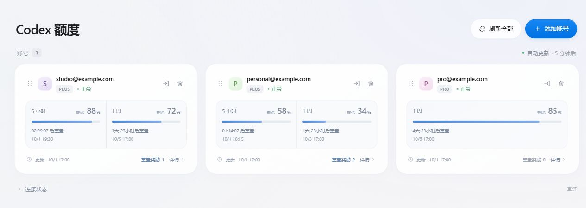
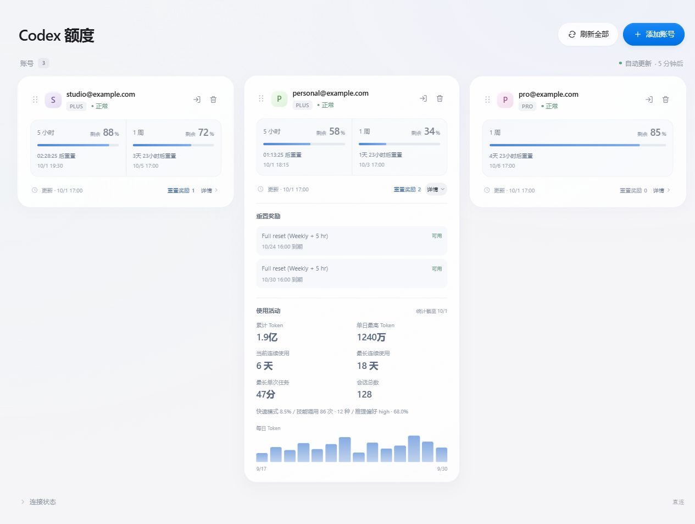

# Codex Quota Monitor

在本机集中查看多个 **Codex 账号的额度、重置奖励与使用活动**。支持 Windows / macOS。



<details>
<summary>查看奖励与活动统计界面</summary>



</details>

## 特点

- **轻量**：单个 Node.js 后台进程，本机 Windows、3 个 Plus 账号实测约 **55 MB 内存**，不含浏览器；实际占用会随环境变化。
- **零 npm 依赖**：Node.js + 原生网页，无需 `npm install`、Codex CLI、数据库或浏览器自动化。
- **集中查看**：多账号、拖动排序、重置倒计时、奖励有效期、Token 活动统计；单个账号失败不影响其他账号。
- **本机保存**：OAuth 登录，不保存密码；网页不接触 Token，服务只监听 localhost。

额度和奖励次数每 **5 分钟**更新；奖励明细与活动在展开时查询，缓存 **15 分钟**。

## 快速开始

1. 安装 **[Node.js 24.14+](https://nodejs.org/en/download)**，这是唯一需要额外安装的运行依赖。
2. **[下载 ZIP](https://github.com/neystan/codex-quota-monitor/archive/refs/heads/main.zip)**，解压到固定目录，在该目录打开终端。
3. 选择下面的手动运行或自启动方式，打开 **[监控页面](http://127.0.0.1:17880/)**，点击「添加账号」。

需要代理时，打开代理软件的 **系统代理**，端口会自动读取，规则分流由代理软件处理。无需开启虚拟网卡。[代理说明](docs/USAGE.md#系统代理)

<details>
<summary>Node.js 安装命令（已有 24.14+ 可跳过）</summary>

Windows / PowerShell：

```powershell
winget install --id OpenJS.NodeJS.LTS --exact --source winget
```

没有 `winget` 时，从 [Node.js 官网](https://nodejs.org/en/download) 下载安装包。

macOS / 终端：下载并打开官方安装包，Intel / Apple Silicon 通用。

```sh
node_pkg=$(curl -fsSL https://nodejs.org/dist/latest-v24.x/SHASUMS256.txt | awk '$2 ~ /\.pkg$/ {print $2; exit}')
curl -fL "https://nodejs.org/dist/latest-v24.x/$node_pkg" -o "${TMPDIR:-/tmp}/$node_pkg"
open "${TMPDIR:-/tmp}/$node_pkg"
```

安装后重新打开终端，执行 `node --version` 确认版本。无需安装其他 npm 包、Git 或 Python。

</details>

## 手动运行

```sh
node server.js
```

保持终端打开，按 **Ctrl+C** 停止。**关闭网页不会停止服务。**

## 登录后自动启动

只需设置一次，服务立即在后台运行；以后登录系统时自动启动，网页按需打开。

Windows / PowerShell（同时创建桌面网页入口）：

```powershell
powershell -NoProfile -ExecutionPolicy Bypass -File .\windows.ps1 -Action Install
```

macOS / 终端：

```sh
chmod +x macos.command
./macos.command Install
```

macOS 也可双击 `macos.command`，手动启动服务并打开网页。

<details>
<summary>后台管理：手动启动、停止、取消自启动、查看状态</summary>

Windows / PowerShell：

```powershell
powershell -NoProfile -ExecutionPolicy Bypass -File .\windows.ps1 -Action Start      # 后台启动
powershell -NoProfile -ExecutionPolicy Bypass -File .\windows.ps1 -Action Stop       # 停止服务
powershell -NoProfile -ExecutionPolicy Bypass -File .\windows.ps1 -Action Uninstall  # 取消自启动
powershell -NoProfile -ExecutionPolicy Bypass -File .\windows.ps1 -Action Status     # 查看状态
```

macOS / 终端：

```sh
./macos.command Start       # 后台启动
./macos.command Stop        # 停止服务
./macos.command Uninstall   # 取消自启动
./macos.command Status      # 查看状态
```

`Stop` 保留自启动设置；`Uninstall` 保留当前运行的服务。**彻底停用需依次执行两者**，账号授权会保留。

</details>

## 更多说明

账号操作、数据目录、代理、日志与兼容性见 **[完整使用说明](docs/USAGE.md)**。

非官方工具，非公开接口可能变化；不要分享本机的 `accounts.json` 授权文件。[MIT License](LICENSE)
